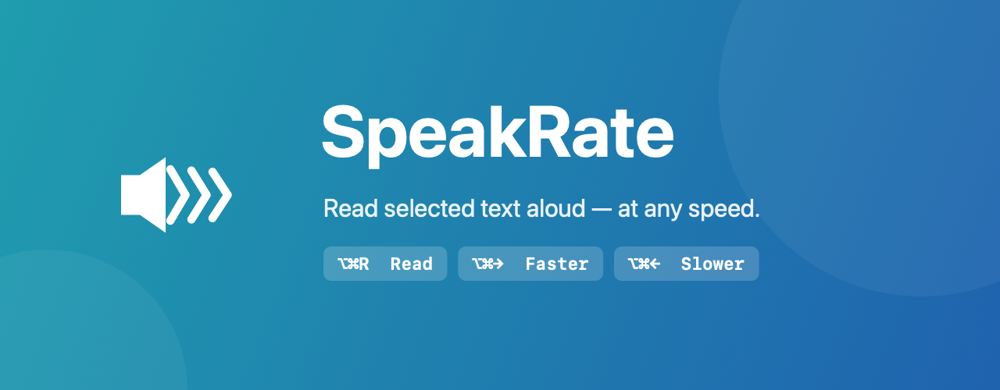

<p align="center">
  
</p>

<p align="center">
  
  
  
  
</p>

# SpeakRate

A lightweight macOS menu bar app that reads your **selected text aloud** with a keyboard shortcut — and lets you change the reading speed **instantly, even while it's speaking**.

It uses its own speech engine (`AVSpeechSynthesizer`), so unlike the built-in ⌥Escape reader, the speed is fully under your control and responds in real time. It automatically detects the language of the selected text (English, Spanish, French, and more) and picks a matching voice.

## Why

macOS can speak selected text with ⌥Escape, but there's no reliable way to change its speed on the fly — the rate is buried in System Settings and doesn't apply to text that's already being read. SpeakRate fixes that: select text, press a shortcut, and speed up or slow down live with the arrow keys until it feels right.

## Features

- **⌥⌘R** — read the selected text aloud (press again to stop)
- **⌥⌘→ / ⌥⌘←** — speed up / slow down in fine steps, applied **live** mid-sentence
- **Automatic language detection** — picks the right voice per selection
- **Menu bar indicator** — shows the current speed in words-per-minute
- **Works in any app** — copies the selection behind the scenes and restores your clipboard

## Installation

### Option A: Download (recommended)

1. Download `SpeakRate-x.x.x-arm64.zip` from the [latest release](../../releases/latest)
2. Unzip and drag `SpeakRate.app` to your `/Applications` folder
3. Open it — if macOS shows a security warning, go to **System Settings → Privacy & Security** and click **Open Anyway**
4. **Grant Accessibility permission** (required to read your selection):
   - The app will prompt automatically, or open **System Settings → Privacy & Security → Accessibility**
   - Enable **SpeakRate**
   - **Quit and reopen the app** so it picks up the permission

> **Requires:** macOS 13 Ventura or later · Apple Silicon (M1 and later)

### Option B: Build from source

**Requirements:** Xcode Command Line Tools (`xcode-select --install`)

```bash
git clone https://github.com/augustose/SpeakRate.git
cd SpeakRate
make install
```

## Usage

| Shortcut | Action |
|----------|--------|
| **⌥⌘R** | Read selected text / stop |
| **⌥⌘→** | Faster (live) |
| **⌥⌘←** | Slower (live) |

1. Select text in any app
2. Press **⌥⌘R** to start reading
3. While it reads, press **⌥⌘→** or **⌥⌘←** to fine-tune the speed — it adjusts immediately, continuing from where it is
4. Press **⌥⌘R** again to stop

The menu bar icon always shows the current speed in words-per-minute.

## Privacy

SpeakRate reads the selected text only when you press the shortcut. It needs **Accessibility** permission to copy the current selection (it simulates ⌘C and restores your clipboard afterwards). Nothing is stored, logged, or sent anywhere — all speech happens locally on your Mac.

## Auto-launch at login

**System Settings → General → Login Items** → add `SpeakRate.app`.

## Building a release

```bash
git tag v1.0.0
make release   # produces SpeakRate-v1.0.0-arm64.zip
```

## License

MIT
